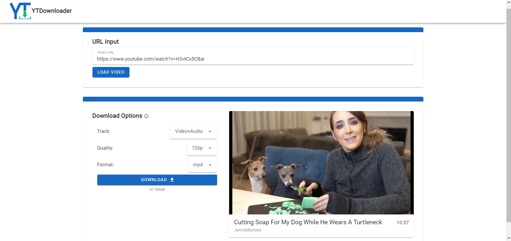

## YTDownloader

Easily download YouTube videos using just the video URL🔗.



Created by [Nick Somsen](mailto:nicksomsen@gmail.com) using [pytube](https://github.com/pytube/pytube).

### Installation
Docker and Docker Compose must be installed. See https://docs.docker.com/get-docker/ to install Docker on your operating system.

In the parent directory, run:
```shell
docker compose build
```
This will build the front-end and back-end images. The front-end is a Vue + Vuetify app with Vite as build tool. The back-end is a Python FastAPI server.

You can now use YTDownloader, see the [Usage](#usage) chapter.

> Alternatively, if you don't want to use Docker, use `backend/requirements.txt` and `frontend/package.json` to install the required dependencies and then run the development servers.

### Usage
In the parent directory, run:
```shell
docker compose up -d
```
Now, open **http://127.0.0.1:8080** in a browser and start downloading!

> Use `docker compose down` to stop the containers.

### Troubleshooting
Both the front-end and back-end run on `localhost` (or `http://127.0.0.1`), with the front-end on port `8080` and the back-end on `8000`. Ensure that these ports are not in use by other apps.
